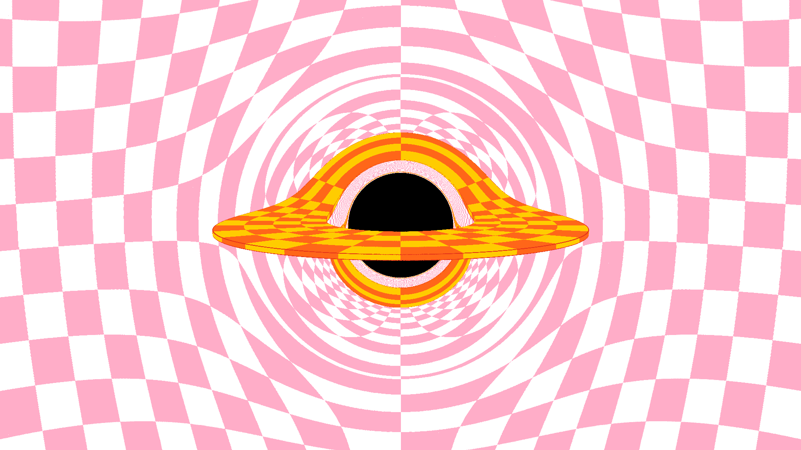

# Schwarzschild Black Hole Visualization

This repository contains Python and GLSL shader code to generate visualizations of a Schwarzschild black hole. The Schwarzschild black hole is a non-rotating, uncharged black hole, and this project uses ray tracing techniques to simulate the gravitational lensing effects around it.

## Files in the Repository

- **`main.py`**: This Python script manages the setup, initialization, and rendering process. It interfaces with the compute shader to generate the final image.
  
- **`compute_shader.glsl`**: A GLSL compute shader responsible for the heavy lifting of ray tracing the black hole and its surrounding environment.

## Requirements

- Python 3.x
- NumPy
- ModernGL
- Pillow

You can install the required Python packages using:

```bash
pip install -r requirements.txt
```

## How to Run

1. Clone the repository:
   ```bash
   git clone https://github.com/pedropasa03/bh-testing.git
   cd bh-testing
   ```
   
2. Install the dependencies
   ```bash
   pip install -r requirements.txt
   ```
   
3. Run the script
   ```bash
   python src/main.py
   ```
This will generate and display an image of a Schwarzschild black hole.

## Examples

Example images generated by this project can be found in the `examples` folder within the repository.

Here is an example of the kind of image this project generates:



Feel free to explore the [examples](examples) folder for more visualizations.

## References

I took the main idea from this [YouTube video](https://www.youtube.com/watch?v=PjWjZFwz3rQ) and I verified the equations from this [Wikipedia article](https://en.wikipedia.org/wiki/Schwarzschild_geodesics). I also used the [Rodrigues' rotation formula](https://en.wikipedia.org/wiki/Rodrigues%27_rotation_formula) and the [sphere UV coordinates](https://en.wikipedia.org/wiki/UV_mapping).

## License

This project is licensed under the MIT License. See the [LICENSE](LICENSE) file for more details.
