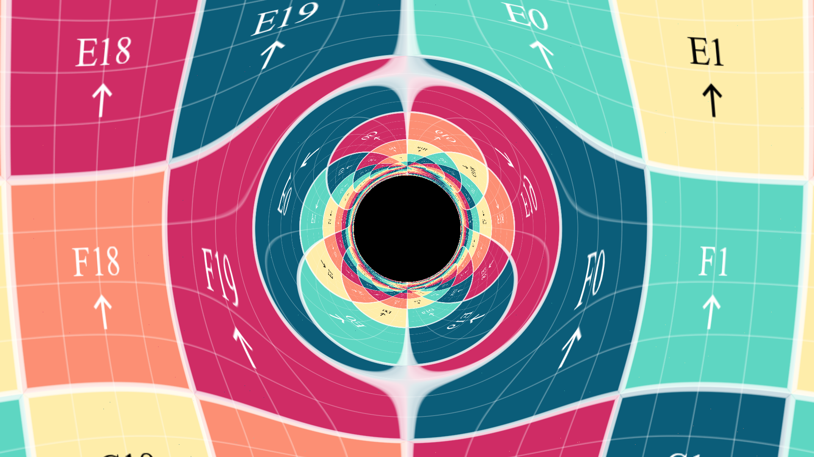

# Schwarzschild Black Hole Visualization

This repository contains Python and GLSL shader code to generate visualizations of a Schwarzschild black hole. The Schwarzschild black hole is a non-rotating, uncharged black hole, and this project uses ray tracing techniques to simulate the gravitational lensing effects around it.

## Results

Example images generated by this project can be found in the `examples` folder within the repository.

Here are some examples of the kind of image this project generates:




Feel free to explore the [examples](examples) folder for more visualizations.

## Usage

### How to install

> [!WARNING]
> This is steps are deprecated. New instructions are WIP.

1. Clone the repository:
   ```bash
   git clone https://github.com/pedropasa03/bh-testing.git
   cd bh-testing
   ```
   
2. Install the dependencies
   ```bash
   pip install -r requirements.txt
   ```
   
And everything will be up and running.

### How to generate images

> [!WARNING]
> This is steps are deprecated. New instructions are WIP.

In the folder `tests` you can find a test file that will produce an image if executed.

```bash
pyhon tests/test.py
```

You can edit the file to your liking and use your own textures.


## References

I took the main idea from this [YouTube video](https://www.youtube.com/watch?v=PjWjZFwz3rQ) and I verified the equations from this [Wikipedia article](https://en.wikipedia.org/wiki/Schwarzschild_geodesics). I also used the [Rodrigues' rotation formula](https://en.wikipedia.org/wiki/Rodrigues%27_rotation_formula) and the [sphere UV coordinates](https://en.wikipedia.org/wiki/UV_mapping).

## License

This project is licensed under the MIT License. See the [LICENSE](LICENSE) file for more details.
